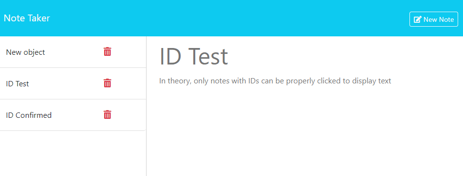

# module-11-note-taker

## Description

This is a webpage that allows you to make a list of notes.

## Table of Contents

[Installation](#installation)  
 [Usage](#usage)  
[Credits](#credits)  
 [Questions](#questions)

## Installation

- Initialize npm in the console by typing "npm i" once navigated to the file folder
- Run the "node server.js" file through the console
- View the application in your browser at "http://localhost:3001"

## Usage

- View the application in your browser at "http://localhost:3001"
- Type notes  
  

## Credits

- Starter code from https://github.com/coding-boot-camp/miniature-eureka

## Questions

https://github.com/scook9
